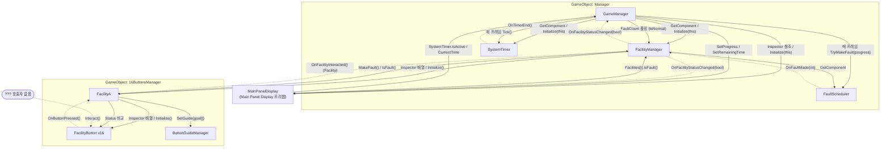
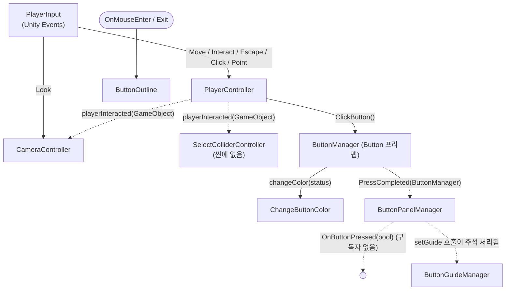
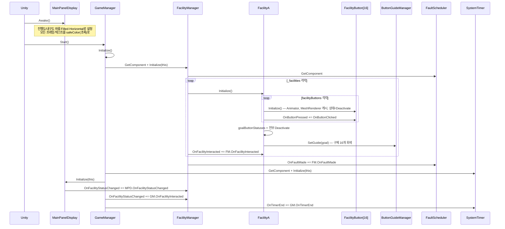
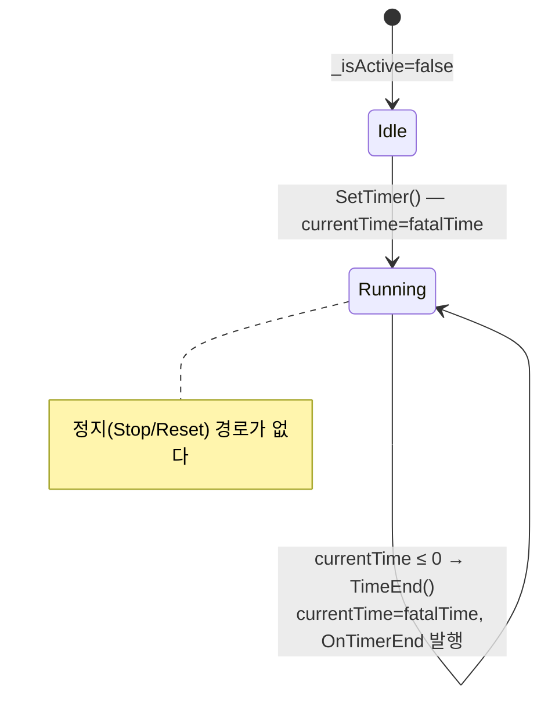
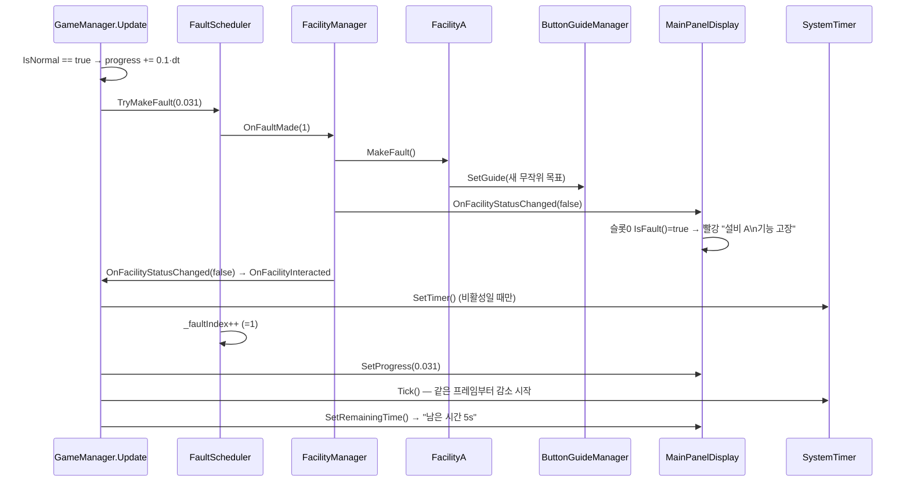
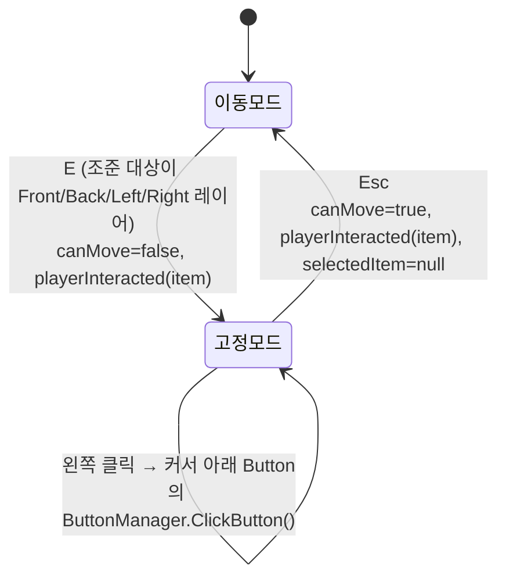

> **기준 시점** : 브랜치 `origin/feature/systemRefactoring`, 커밋 `74fe256` (+ 작업 트리의 `RefactoringTesetScene.unity` 수정분), Unity `6000.3.22f1`
> **범위** : `Assets/Scripts` 전체 C# 코드, `Assets/Scenes`, `Assets/Prefabs`, `ProjectSettings`(레이어, 입력 설정)
> **목적** : 지금 코드가 **실제로** 어떻게 돌아가는지, 각 시스템이 어떻게 연결되어 있는지 기록한다. 설계 의도는 「게임 진행 규칙」, 「시스템 명세_참고만」을 보고, 이 문서는 구현 현황만 다룬다. 설계와 다른 점은 11장에 모았다.
> 코드 위치는 `파일:줄` 형식으로 적었다. 줄 번호는 위 커밋 기준이다.

## 목차
1. 한눈에 보기
2. 전체 구조도
3. 초기화 순서
4. 프레임 루프 (GameManager.Update)
5. 코어 시스템 상세
6. 이벤트 카탈로그
7. 시나리오별 실제 동작
8. 플레이어 · 레거시 버튼 계열
9. 에디터 도구 : 포스터 굽기
10. 씬 · 프리팹 · 프로젝트 설정
11. 설계 문서 대비 구현 현황
12. 알려진 문제와 위험 요소
13. 연결 작업 제안

---

## 1. 한눈에 보기

코드는 **서로 연결되지 않은 두 계열**로 나뉘어 있다.

| 계열 | 구성 | 사용 씬 | 상태 |
| --- | --- | --- | --- |
| **신규 코어 계열** (리팩터링) | GameManager, FacilityManager, FaultScheduler, SystemTimer, Facility / FacilityA / FacilityButton, ButtonGuideManager, MainPanelDisplay | `RefactoringTesetScene` | 진행도 → 고장 → 타이머 → UI 표시까지 동작. **수리 입력 경로가 없다** (FacilityButton.Interact를 부르는 곳이 없음) |
| **레거시 플레이어 · 버튼 계열** | PlayerController, CameraController, ButtonManager, ButtonPanelManager, ChangeButtonColor, ButtonOutline | `PlayerAndSpace`, `ButtonTestScene`, `Button16TestScene` | 1인칭 이동, 벽 선택 후 시점 고정, 버튼 클릭까지 동작. **게임 규칙(진행도, 고장, 타이머)과 연결되어 있지 않다** |

두 계열이 공유하는 것은 `ButtonStatus` 열거형(`ButtonManager.cs`에 정의)과 `ButtonGuideManager`뿐이다.

### 스크립트 목록

| 스크립트 | 폴더 | 계열 | 역할 요약 | 붙어 있는 곳 |
| --- | --- | --- | --- | --- |
| `GameManager` | Scripts | 코어 | 진행도 증가, 매니저 초기화, 프레임 루프 | RefactoringTesetScene `Manager`, (TestManagerScene) |
| `FacilityManager` | Scripts | 코어 | 설비 목록 보관, 고장 수 집계, 고장 이벤트 중계 | RefactoringTesetScene `Manager` |
| `FaultScheduler` | Scripts | 코어 | 진행도 기준 고장 발생 시점 판단 | RefactoringTesetScene `Manager`, (TestManagerScene) |
| `SystemTimer` | Scripts | 코어 | 시스템 이상 카운트다운 | RefactoringTesetScene `Manager` |
| `Facility` | Scripts/Facility | 코어 | 설비 추상 기반 클래스 | — (추상) |
| `FacilityA` | Scripts/Facility | 코어 | 4x4 버튼 설비. 목표 패턴 생성 · 비교 | RefactoringTesetScene `16ButtonsManager` |
| `FacilityButton` | Scripts/Facility | 코어 | 3상태 토글 버튼 (IInteractable) | RefactoringTesetScene `Button ~ Button (15)` |
| `IInteractable` | Scripts/Facility | 코어 | `Interact()` 인터페이스 | — |
| `EnumExtensions` | Scripts/Utility | 공용 | 열거형 순환 `Next()` | — (정적) |
| `ButtonGuideManager` | Scripts | 공용 | 목표 패턴을 구체 16개 색으로 표시 | 16ButtonsManager 프리팹 `ButtonGuide`, RefactoringTesetScene |
| `MainPanelDisplay` | Scripts/UI | 코어 | 전면 메인 패널 월드 UI | `Main Panel Display` 프리팹 |
| `PlayerController` | Scripts | 레거시 | 1인칭 이동, 레이캐스트 선택, 클릭 | PlayerAndSpace `PlayerTemp` |
| `CameraController` | Scripts | 레거시 | 마우스 시점, 선택 시 시점 고정 연출 | PlayerAndSpace `Main Camera` |
| `SelectColliderController` | Scripts | 레거시 | 선택된 벽 오브젝트의 콜라이더 토글 | **사용처 없음** |
| `ButtonManager` | Scripts | 레거시 | 버튼 눌림 애니메이션 + 상태 순환. **`ButtonStatus` 열거형 정의 위치** | Button 프리팹 |
| `ButtonPanelManager` | Scripts | 레거시 | 16버튼 정답 검사 | 16ButtonsManager 프리팹 |
| `ChangeButtonColor` | Scripts | 레거시 | 상태에 맞춰 머티리얼 교체 | Button 프리팹 `Clickable` |
| `ButtonOutline` | Scripts | 레거시 | 마우스 호버 시 아웃라인 머티리얼 추가 | Button 프리팹 |
| `SoundManager` | Scripts | — | 빈 클래스 | **사용처 없음** |
| `PosterBakeSource` | Scripts/Utility | 도구 | 포스터 굽기 설정 컴포넌트 | ManualPosterScene |
| `PosterBakeSourceEditor` / `PosterBaker` | Scripts/Editor | 도구 | 인스펙터 버튼, 굽기 실행 | 에디터 전용 |

---

## 2. 전체 구조도

### 2.1 코어 계열 : 참조와 이벤트

실선은 직접 참조(메서드 호출), 점선은 C# 이벤트(`Action`) 구독이다. 화살표는 **호출 / 알림이 흘러가는 방향**이다.



핵심 구조
- **GameManager가 루트**다. 다른 매니저는 스스로 `Start`/`Update`를 쓰지 않고, GameManager가 `Initialize`와 매 프레임 호출(`Tick`, `TryMakeFault`)을 몰아서 한다.
- **같은 GameObject 의존** : GameManager는 `GetComponent`로 FacilityManager와 SystemTimer를, FacilityManager는 `GetComponent`로 FaultScheduler를 찾는다 (`GameManager.cs:44-45`, `FacilityManager.cs:37`). 네 컴포넌트가 반드시 **같은 GameObject**에 있어야 한다. `[RequireComponent]`는 걸려 있지 않다.
- **상태는 폴링, 변화는 이벤트** : "지금 고장인가"는 매 프레임 `FacilityManager.FaultCount` → 각 `Facility.IsFault()`로 계산한다. 고장 **발생**만 이벤트로 알린다. 수리 **완료**는 이벤트가 없다 (7.2 참고).
- 이벤트는 모두 `event` 키워드 없는 **public `Action` 필드**다. 외부에서 `=`로 덮어쓰거나 직접 `Invoke`할 수 있다.

### 2.2 레거시 계열 : 참조와 이벤트



---

## 3. 초기화 순서

Unity 생명주기 기준으로 실제 호출 순서를 정리했다.



주의할 점
- `OnFacilityStatusChanged` 구독 순서는 **MainPanelDisplay → GameManager**다. 고장이 나면 UI가 먼저 갱신되고, 그다음 타이머가 켜진다.
- `FaultScheduler.Initialize()`는 비어 있고 **아무도 호출하지 않는다**.
- 초기 상태에서 설비 A는 목표도 버튼도 모두 `Deactivate`이므로 `IsFault() == false`, 즉 정상으로 시작한다.
- MainPanelDisplay의 설비 슬롯 텍스트는 초기화 때 **갱신되지 않는다**. 프리팹에 적힌 기본 텍스트가 그대로 보이다가 첫 고장 이벤트 때 처음 바뀐다.
- `FacilityButton`, `FacilityA`는 `Awake`/`Start`를 쓰지 않는다. **FacilityManager의 `_facilities` 배열에 등록되지 않은 설비는 초기화되지 않는다.**

---

## 4. 프레임 루프 (GameManager.Update)

`GameManager.cs:56-77`. 게임의 모든 진행이 이 한 함수에서 일어난다.

```
Update()
├─ if IsNormal  (FacilityManager.FaultCount == 0, 매 프레임 모든 설비 IsFault() 호출)
│   ├─ _progressValue += deltaProgress * deltaTime
│   ├─ FaultScheduler.TryMakeFault(_progressValue / maxProgressValue)   ← 고장이 여기서 동기적으로 발생할 수 있다
│   └─ MainPanelDisplay.SetProgress(정규화 진행도)
├─ SystemTimer.Tick()           ← 활성 상태면 카운트다운, 0 이하면 OnTimerEnd
├─ MainPanelDisplay.SetRemainingTime()
└─ if 진행도 > 1  →  (비어 있음. 승리 처리 없음)
```

- 진행도는 **정규화 값(0~1)** 으로 FaultScheduler와 UI에 넘긴다. 내부 값 `_progressValue`는 0 ~ `maxProgressValue`.
- 고장 중(`IsNormal == false`)에는 진행도 증가와 `TryMakeFault` 호출이 모두 멈춘다. 그래서 고장 중에 다음 고장이 겹쳐 발생하지 않는다 (설계 의도와 일치).
- 진행도가 1을 넘어도 계속 증가한다 (상한 클램프 없음, 승리 처리 없음). UI 바는 `Mathf.Clamp01`로 100%에서 멈춘다.

### 현재 씬 수치 (RefactoringTesetScene `Manager`)

| 항목 | 값 | 의미 |
| --- | --- | --- |
| `GameManager.deltaProgress` | 0.1 /초 | |
| `GameManager.maxProgressValue` | 10 | → 정규화 진행도 **1%/초**, 고장 없이 100초에 100% |
| `GameManager.maxDurability` | 5 | 코드에서 사용하지 않음 |
| `FaultScheduler.faultSchedules[0]` | Timing 0.03, Count 1 | 진행도 3% (약 3초) |
| `FaultScheduler.faultSchedules[1]` | Timing 0.2, Count 1 | 진행도 20% |
| `SystemTimer.fatalTime` | 5초 | |

코드 기본값은 `maxProgressValue = 100`, `fatalTime = 30`이며 씬에서 테스트용으로 덮어쓴 상태다.

---

## 5. 코어 시스템 상세

### 5.1 GameManager (`GameManager.cs`)

| 구분 | 내용 |
| --- | --- |
| 역할 | 루트 매니저. 하위 매니저 초기화, 진행도 누적, 매 프레임 루프 구동 |
| 인스펙터 | `mainPanelDisplay`(참조), `deltaProgress`, `maxProgressValue`, `maxDurability` |
| 내부 상태 | `_progressValue` |
| 공개 API | `FacilityManager`, `SystemTimer` (프로퍼티), `IsNormal` |
| 구독 | `FacilityManager.OnFacilityStatusChanged` → `OnFacilityInteracted(bool)`, `SystemTimer.OnTimerEnd` → `OnTimerEnd()` |

- `OnFacilityInteracted(bool isCompleted)` (`:78`) : 이름과 달리 **고장 발생 이벤트**에 연결되어 있다. 타이머가 꺼져 있으면 `SetTimer()`로 켠다. 인자는 쓰지 않는다.
- `OnTimerEnd()` (`:86`) : `Debug.Log("시스템 유지 실패")`만 한다. 내구도 감소 없음.
- `_faultScheduler` 필드(`:21`)는 선언만 있고 할당·사용되지 않는다. 실제로는 `_facilityManager.FaultScheduler`를 쓴다.
- `maxDurability`는 쓰이지 않는다. 내구도 상태 자체가 아직 없다.
- 승리(`:72-75`)·패배 처리, 재시작, 게임 종료 상태가 없다.

### 5.2 FacilityManager (`FacilityManager.cs`)

| 구분 | 내용 |
| --- | --- |
| 역할 | 설비 등록부. 고장 수 집계, FaultScheduler의 고장 요청을 설비에 전달, 상태 변화 알림 |
| 인스펙터 | `_facilities : Facility[]` (씬에서는 FacilityA 1개) |
| 공개 API | `FaultScheduler`, `Facilities`, `FaultCount`, `Initialize(GameManager)` |
| 발행 이벤트 | `OnFacilityStatusChanged : Action<bool>` |
| 구독 | 각 `Facility.OnFacilityInteracted` → `OnFacilityInteracted()`, `FaultScheduler.OnFaultMade` → `OnFaultMade(int)` |

- `FaultCount` (`:21-32`) : 호출될 때마다 모든 설비의 `IsFault()`를 돈다. 캐시 없음. GameManager가 매 프레임 호출한다.
- `OnFaultMade(int count)` (`:56-62`) : **`count`를 무시하고 항상 `_facilities[0].MakeFault()`** (주석 "임시 코드"). 그다음 `OnFacilityStatusChanged(false)`를 보낸다.
- `OnFacilityInteracted()` (`:51-54`) : **비어 있다.** 버튼을 눌러도 여기서 끊긴다. 수리 완료 감지, 정상 복귀 이벤트가 이 자리에 들어가야 한다.
- `_gameManager` 필드는 저장만 하고 쓰지 않는다.

### 5.3 FaultScheduler (`FaultScheduler.cs`)

| 구분 | 내용 |
| --- | --- |
| 역할 | 진행도가 다음 고장 지점을 넘었는지 판단하고 고장 이벤트를 발행 |
| 데이터 | `FaultSchedule { float FaultTiming; int FaultFacilityCount; }` 배열 (`faultSchedules`) |
| 내부 상태 | `_faultIndex` (다음에 발생할 스케줄 인덱스) |
| 공개 API | `SoonFaultTiming`, `TryMakeFault(float progress)`, `Initialize()`(빈 함수) |
| 발행 이벤트 | `OnFaultMade : Action<int>` (고장 설비 수) |

- `FaultTiming`은 **정규화 진행도(0~1)** 로 해석된다 (GameManager가 `_progressValue / maxProgressValue`를 넘기므로).
- `TryMakeFault` (`:28-39`) : `progress > faultSchedules[_faultIndex].FaultTiming`이면 이벤트를 보내고 인덱스를 1 올린다. 한 프레임에 최대 1개만 발생한다.
- **범위 검사가 없다.** 마지막 스케줄이 소진된 뒤(`_faultIndex == Length`) 다시 호출되면 `SoonFaultTiming`에서 `IndexOutOfRangeException`이 난다. 배열이 비어 있으면 첫 프레임부터 예외. (12장 참고)
- 스케줄은 **인스펙터에 고정값**으로 들어간다. 설계의 "구간 안에서 무작위 지점", "설비 ID 지정"은 아직 없다.
- `_facilityManager` 필드는 선언만 있다.

### 5.4 SystemTimer (`SystemTimer.cs`)

| 구분 | 내용 |
| --- | --- |
| 역할 | 시스템 이상 카운트다운 |
| 인스펙터 | `fatalTime` (코드 기본 30, 씬 5) |
| 내부 상태 | `_isActive`, `_currentTime` |
| 공개 API | `IsActive`, `CurrentTime`, `Initialize(GameManager)`, `SetTimer()`, `Tick()` |
| 발행 이벤트 | `OnTimerEnd : Action` |

상태 전이



- `Tick()`은 스스로 부르지 않고 GameManager가 매 프레임 부른다. 고장 여부와 상관없이 항상 호출된다.
- `TimeEnd()` (`:39-44`) 는 시간을 되돌리고 `_isActive = true`를 유지한다. 즉 **한 번 켜지면 영원히 `fatalTime` 주기로 `OnTimerEnd`가 반복**된다. 모든 설비가 정상으로 돌아와도 멈추는 코드가 없다.
- `_gameManager`는 저장만 하고 쓰지 않는다.

### 5.5 설비 : Facility / FacilityA / FacilityButton

#### Facility (`Facility/Facility.cs`) — 추상 기반

| 멤버 | 설명 |
| --- | --- |
| `Action OnFacilityInteracted` | 설비의 장치가 조작되면 발행. 어떤 설비인지, 상태가 어떤지 정보는 없다 |
| `int facilityID` / `FacilityID` | 인스펙터 값. 현재 아무 곳에서도 읽지 않는다 (씬 값 0) |
| `abstract Initialize()` | FacilityManager가 호출 |
| `abstract bool IsFault()` | 현재 고장 여부. **목표와 장치 상태를 비교해 계산**한다 (별도 상태 플래그 없음) |
| `abstract MakeFault()` | 새 목표를 만들어 고장 상태로 만든다 |

설계 포인트 : "고장"을 플래그로 들고 있지 않고 **"장치 상태 ≠ 목표"** 로 정의한다. 그래서 목표를 바꾸는 순간 고장이 되고, 장치를 목표에 맞추는 순간 저절로 정상이 된다 (자동 완료 판정과 일치). 대신 "고장 → 정상"으로 바뀌는 **순간**을 알려면 누군가 변화 전후를 비교해야 하는데, 현재 그 역할을 하는 코드가 없다.

#### FacilityA (`Facility/FacilityA.cs`) — 4x4 버튼 설비

| 구분 | 내용 |
| --- | --- |
| 인스펙터 | `facilityButtons : FacilityButton[]` (16개), `buttonGuideManager` |
| 내부 상태 | `goalButtonStatuses : ButtonStatus[]` (목표 패턴) |

- `Initialize()` (`:12-28`) : 버튼 16개 초기화·구독, 목표를 전부 `Deactivate`로, 가이드 표시.
- `IsFault()` (`:30-41`) : 버튼 i의 `Status`가 목표 i와 하나라도 다르면 `true`.
- `MakeFault()` (`:43-50`) : 목표 16칸을 `Random.Range(0, 3)`(Deactivate / Red / Green)으로 새로 뽑고 가이드를 갱신한다. 루프 횟수가 **`16` 하드코딩**이다.
  - 현재 버튼 상태와 겹치지 않게 하는 처리는 없다. 16칸 모두 우연히 일치할 확률은 1/3¹⁶로 사실상 0이라 실해는 없다.
- `OnButtonClicked()` : 버튼이 눌리면 `OnFacilityInteracted`를 그대로 중계.

#### FacilityButton (`Facility/FacilityButton.cs`) — 3상태 토글 버튼

| 구분 | 내용 |
| --- | --- |
| 구현 | `MonoBehaviour, IInteractable` |
| 인스펙터 | `greenColor`, `redColor`, `grayColor` 머티리얼 |
| 캐시 | `_animator = GetComponent<Animator>()`, `mesh = GetComponent<MeshRenderer>()` (같은 GameObject) |
| 상태 | `_status : ButtonStatus`, 공개 `Status` |
| 발행 이벤트 | `OnButtonPressed : Action` |

- `Interact()` (`:31-36`) : Animator 트리거 `"ButtonPressed"` → 상태를 `Next()`로 순환 → 머티리얼 교체 → `OnButtonPressed`.
- 상태 순환 : `Deactivate(회색) → Red → Green → Deactivate …` (`EnumExtensions.Next`, 열거형 선언 순서대로 순환).
- **현재 `Interact()`를 호출하는 코드가 프로젝트 전체에 없다.** `IInteractable`을 찾아 부르는 입력 코드(설계상 PlayerInteractor)가 아직 없다.
- 씬의 버튼 루트 GameObject에는 `Transform, AudioSource, BoxCollider, FacilityButton`만 있다. **Animator와 MeshRenderer가 없다** (메시는 자식 `Clickable`에 있음). 따라서 지금 상태로 `Interact()`를 부르면 `_animator`가 null이라 `NullReferenceException`이 난다. (12장)
- 미사용 : `_interactableImplementation` 필드, `using Unity.VisualScripting`, `using UnityEngine.UI`.

#### IInteractable / EnumExtensions

- `IInteractable` : `void Interact()` 하나. 설계 문서의 누름 / 드래그 / 뗌 확장은 아직 없다.
- `EnumExtensions.Next<T>()` : `Enum.GetValues` 순서 기준 다음 값, 마지막이면 처음으로. 호출할 때마다 배열을 할당한다(버튼 클릭 빈도라 문제 없음).

#### ButtonStatus 열거형

```csharp
// ButtonManager.cs:3 (레거시 파일에 있음)
public enum ButtonStatus { Deactivate = 0, Red = 1, Green = 2 }
```
신규 계열(FacilityA, FacilityButton, ButtonGuideManager)도 이 열거형을 쓴다. **`ButtonManager.cs`를 지우면 신규 계열이 컴파일되지 않는다.** 레거시 정리 전에 열거형을 별도 파일로 옮겨야 한다.

### 5.6 ButtonGuideManager (`ButtonGuideManager.cs`)

- 목표 패턴을 **구체(Sphere) 16개의 머티리얼 색**으로 보여주는 표시 전용 컴포넌트. 설계 문서의 TargetPatternDisplay에 해당한다.
- `SetGuide(ButtonStatus[])` : `i = 0..15` 고정 루프로 `spheres[i].material`을 gray / red / green으로 교체. `spheres`, 입력 배열 모두 16개 이상이어야 한다.
- 설계는 "고장일 때만 표시"이지만, 현재는 초기화 때 전부 회색으로 표시하고 고장 때 색을 바꾼다. 수리 후에도 목표 패턴이 그대로 남는다.
- 신규 계열에서는 FacilityA가, 레거시 계열에서는 ButtonPanelManager가 호출하도록 되어 있다(레거시 쪽은 호출이 주석 처리됨, 8.4).

### 5.7 MainPanelDisplay (`UI/MainPanelDisplay.cs`)

전면 메인 패널. `Main Panel Display` 프리팹 루트의 **World Space Canvas**에 붙는다. (클래스 이전 이름은 `MainPanelView`, 직렬화 데이터에 흔적이 남아 있음)

| 영역 | 인스펙터 필드 | 갱신 메서드 | 현재 호출자 |
| --- | --- | --- | --- |
| 설비 슬롯 | `facilitySlots[] {name, frame, statusText}` (프리팹에 "설비 A" 1개) | `OnFacilityTrouble(i)`, `OnFacilityNormalize(i)` | `OnFacilityStatusChanged` 이벤트 |
| 진행도 | `progressFrame`, `progressText`, `progressBar` | `SetProgress(0~1)` — 바만 갱신 | GameManager.Update |
| 타이머 | `timerFrame`, `timerText` | `SetRemainingTime()` — 활성 시 `"남은 시간\n{초:F0}s"`, 비활성 시 `"--"` | GameManager.Update |
| 내구도 | `durabilityFrame`, `durabilityText`, `durabilityBar` | `SetDurability(0~1)` | **없음** |
| 색 | `safeColor`(초록), `unsafeColor`(빨강), `previewInEditor` | `ApplysafeColor()`, `SetsafeColor(c)` | Awake, OnValidate |

동작
- `Awake` : 두 바를 Filled / Horizontal / Left로 강제 설정하고 모든 요소를 safeColor로 칠한다.
- `Initialize(GameManager)` : GameManager와 FacilityManager 참조 저장, `OnFacilityStatusChanged` 구독.
- `OnFacilityStatusChanged(bool)` : 인자는 무시하고 **모든 설비를 인덱스로 돌면서** `IsFault()` 결과로 슬롯을 빨강("기능 고장") / 초록("정상 작동")으로 칠한다. 즉 **`Facilities[i]` ↔ `facilitySlots[i]`가 인덱스로 1:1 대응**해야 한다.
- `SetRemainingTime()`은 `_gameManager`를 쓰므로 `Initialize` 전에 부르면 NRE. 현재는 GameManager.Start 이후에만 불리므로 안전하다.
- `OnValidate`에서 색을 바로 적용하므로, 에디터에서 safeColor를 바꾸면 즉시 반영된다.

---

## 6. 이벤트 카탈로그

| 이벤트 | 선언 위치 | 타입 | 발행 시점 | 구독자 → 처리 |
| --- | --- | --- | --- | --- |
| `OnFaultMade` | FaultScheduler | `Action<int>` | 진행도가 다음 FaultTiming을 넘은 프레임 | FacilityManager.OnFaultMade → 설비[0] 고장 |
| `OnFacilityStatusChanged` | FacilityManager | `Action<bool>` | **고장 발생 직후에만** (`false`로) | ① MainPanelDisplay → 슬롯 색 갱신 ② GameManager.OnFacilityInteracted → 타이머 시작 |
| `OnFacilityInteracted` | Facility | `Action` | 설비의 버튼이 눌릴 때 | FacilityManager.OnFacilityInteracted → **빈 함수** |
| `OnButtonPressed` | FacilityButton | `Action` | `Interact()` 끝 | FacilityA.OnButtonClicked → 위 이벤트 중계 |
| `OnTimerEnd` | SystemTimer | `Action` | 카운트다운이 0 이하가 될 때마다 | GameManager.OnTimerEnd → 로그만 |
| `playerInteracted` | PlayerController | `event Action<GameObject>` | 벽 선택(E) / 해제(Esc) 둘 다 | CameraController.ToggleView, SelectColliderController.ToggleCollider |
| `PressCompleted` | ButtonManager | `event Action<ButtonManager>` | 눌림 애니메이션 종료 | ButtonPanelManager.OnButtonPressCompleted |
| `OnButtonPressed` | ButtonPanelManager | `Action<bool>` | 버튼 눌림마다 정답 여부 | **구독자 없음** |

- `OnFacilityStatusChanged(bool isCompleted)`의 bool은 발행 측도 구독 측도 의미 있게 쓰지 않는다.
- 이벤트 해제(`-=`) 코드는 레거시 계열(CameraController, SelectColliderController, ButtonPanelManager)에만 있다. 코어 계열은 씬 수명 동안 살아 있어 당장 문제는 없지만, 씬 재시작을 넣을 때 주의.

---

## 7. 시나리오별 실제 동작

RefactoringTesetScene 수치(1%/초, 고장 3% · 20%, fatalTime 5초) 기준이다.

### 7.1 고장 발생



- 이후 프레임부터 `IsNormal == false`라 진행도는 3.1% 근처에서 멈춘다.
- 모든 호출이 **한 프레임 안에서 동기적으로** 일어난다.

### 7.2 수리 (현재는 도달 불가)

설계상 흐름과 현재 코드가 끊기는 지점:

```
[입력]  ──✗── FacilityButton.Interact()     ← 호출하는 코드 없음 (끊김 ①)
            ├─ _animator.SetTrigger()        ← 씬 버튼에 Animator 없음 → NRE (끊김 ②)
            ├─ 상태 순환 + 머티리얼 교체      ← 씬 버튼 루트에 MeshRenderer 없음 → NRE
            └─ OnButtonPressed
                 → FacilityA.OnButtonClicked
                 → Facility.OnFacilityInteracted
                 → FacilityManager.OnFacilityInteracted()  ← 빈 함수 (끊김 ③)
```

만약 ①②가 해결되어 버튼 16개를 목표대로 맞추면, 현재 코드에서는 다음과 같이 된다.
- `IsFault()`가 `false` → 다음 프레임 `IsNormal == true` → **진행도는 폴링 덕분에 다시 오른다.**
- 그러나 ③ 때문에 정상 복귀 이벤트가 없다 → **타이머가 멈추지 않고**, **메인 패널 슬롯은 계속 빨간 "기능 고장"** 으로 남는다.
- 진행도가 20%에 닿으면 2번째 고장(다시 설비 A) 발생. 이때는 타이머가 이미 활성이라 `SetTimer()`가 호출되지 않아 **남은 시간이 리셋되지 않는다**.
- 2번째 고장까지 수리한 뒤 진행도가 다시 오르기 시작하면, `TryMakeFault`가 `faultSchedules[2]`를 읽다가 **IndexOutOfRangeException** → 그 프레임의 `SetProgress`, `Tick`, `SetRemainingTime`이 모두 건너뛰어진다. 매 프레임 반복.

### 7.3 시간 초과

- 고장 후 5초 → `TimeEnd()` → 시간 5초로 되돌림, `OnTimerEnd` → 콘솔에 "시스템 유지 실패".
- 고장이 계속되는 동안 5초마다 반복 (설계의 "재시작"과 일치).
- 내구도 감소, 패배 판정은 없다.
- 수리해도 타이머가 꺼지지 않으므로, 한 번 고장이 난 뒤에는 **정상 상태에서도 5초마다 "시스템 유지 실패"가 찍힌다.**

### 7.4 승리 / 패배

- 승리 분기(`GameManager.cs:72`)는 비어 있다. 진행도 100%를 넘어도 아무 일도 없다.
- 패배(내구도 0)는 내구도 자체가 없어서 없다.

---

## 8. 플레이어 · 레거시 버튼 계열

### 8.1 입력 설정

- `ProjectSettings > activeInputHandler = 2` (**Both**) : 새 Input System과 구 Input Manager를 모두 켰다. 그래서 `ButtonOutline`의 `OnMouseEnter/Exit`(구 방식)도 동작한다.
- 입력 에셋 : `Assets/InputSystem_Actions.inputactions` (Unity 기본 템플릿에 액션 추가)
- PlayerAndSpace 씬의 `PlayerInput`(Behavior = Invoke Unity Events) 바인딩

| 액션 (Player 맵) | 키 | 연결된 메서드 |
| --- | --- | --- |
| Move | WASD / 방향키 | `PlayerController.OnMove` |
| Look | 마우스 delta | `CameraController.OnLook` |
| Interact | E | `PlayerController.OnInteract` |
| Escape | Esc | `PlayerController.OnEscape` |
| Click | 마우스 왼쪽 | `PlayerController.OnClick` |
| Point | 마우스 위치 | `PlayerController.OnPoint` |
| Attack, Crouch, Jump, Previous, Next, Sprint | — | 연결 없음 (템플릿 잔재) |

### 8.2 레이어

| 번호 | 이름 | 쓰는 곳 |
| --- | --- | --- |
| 6 | Button | Button 프리팹 전체. 고정 모드 레이캐스트 대상 |
| 7 | Slider | 설비 B용으로 예약. 아직 오브젝트 없음 |
| 11 ~ 14 | Front, Back, Left, Right | 벽(조작부) 선택 대상. 이동 모드 레이캐스트 대상, 시점 고정 방향 결정 |

PlayerAndSpace 씬 값 : `movingLayerMask = 30720` (11~14번 = 네 벽), `fixedLayerMask = 64` (6번 = Button만. 코드 주석은 "Button, Slider"라고 되어 있지만 Slider는 마스크에 없음)

### 8.3 PlayerController + CameraController : 두 가지 모드

`PlayerController.canMove` 하나로 모드가 갈린다.



**이동 모드** (`canMove == true`)
- `Move()` : `moveInput`으로 CharacterController 이동. 속도 `moveSpeed`(씬 5).
- `ShootCursorFromCamera()` : **플레이어 몸 위치**에서 카메라 forward 방향으로 `maxCursorDistance`(3m) 레이캐스트, `movingLayerMask`. 새 대상이 선택 가능하면 머티리얼을 `highlightedMaterial`로 바꾸고, 대상이 바뀌면 원래 머티리얼로 되돌린다.
- CameraController `MouseRotate()` : 마우스 y → 카메라 pitch(±90° 클램프), 마우스 x → 플레이어 몸 yaw.

**고정 모드** (`canMove == false`)
- `ShootCursorFromMouse()` : 화면 마우스 위치에서 `ScreenPointToRay`, 거리 15m(`maxCursorDistance * 5`), `fixedLayerMask`. 하이라이트는 주석 처리되어 있고 `cursorItem`만 갱신한다. 호버 강조는 대신 `ButtonOutline`이 한다.
- CameraController `FixedItem()` : 선택된 벽 레이어로 바라볼 방향을 정한다.

  | 선택 대상 레이어 | 바라볼 방향(inwardNormal) |
  | --- | --- |
  | Front | `Vector3.left` |
  | Back | `Vector3.right` |
  | Left | `Vector3.back` |
  | Right | `Vector3.forward` |

  목표 위치 = 대상 위치 − 방향 × `viewDistance`(4), 높이 y = 2 고정. 0.6초 동안 SmoothStep(3t² − 2t³)으로 플레이어 몸 위치·회전과 카메라 pitch를 보간한다.
- Esc로 풀면 `isFixed = false`만 하고 원래 위치로 돌아가지 않는다. 그 자리에서 이동 모드로 복귀.

연결 방식 : CameraController가 `Awake`에서 인스펙터로 받은 `playerController.playerInteracted`를 직접 구독한다 (주석 "임시로 직접 연결, 나중에 매니저를 통해 연결").

**SelectColliderController** : `playerInteracted`를 구독해, 선택된 오브젝트 **이름**이 자기 GameObject 이름과 같으면 `selectCollider`를 끄고/켠다. 벽 선택용 큰 콜라이더를 꺼서 뒤의 버튼에 레이가 닿게 하려는 의도로 보인다. **어느 씬에도 붙어 있지 않다.**

### 8.4 레거시 버튼 (Button 프리팹 / 16ButtonsManager 프리팹)

Button 프리팹 구조 (전부 Button 레이어)
```
Button              ButtonManager, BoxCollider, AudioSource, ButtonOutline
├─ FoucsIndicator   MeshRenderer, BoxCollider        (호버 시 아웃라인)
└─ Clickable        MeshRenderer, BoxCollider, ChangeButtonColor  (눌리는 부분, 상태 색)
```

- **ButtonManager** : `ClickButton()` → 코루틴 `MoveAndReturn()` — `animatedChild`를 `localOffset(0, -0.4, 0)`만큼 0.3초 동안 내렸다가, 바닥에서 상태를 `(status + 1) % 3`으로 바꾸고 색을 바꾼 뒤, 0.3초 동안 올린다. 끝나면 `PressCompleted`. 애니메이션 중 재클릭은 무시(`isAnimating`).
- **ChangeButtonColor** : `changeColor(status)` → `mesh.material` 교체 (인스턴스 머티리얼 생성).
- **ButtonOutline** : `OnMouseEnter/Exit`에서 `Clickable`, `FoucsIndicator` 렌더러의 `sharedMaterials`에 아웃라인 머티리얼을 2번째로 추가/제거. 1번째 머티리얼은 그때그때 현재 것을 유지하므로 ChangeButtonColor의 색 변경과 충돌하지 않는다 (커밋 `202a7fa`에서 고친 부분).
- **ButtonPanelManager** (16ButtonsManager 프리팹 루트) : `Start`에서 16칸 무작위 정답(`GuideImage`)을 만들고 모든 버튼의 `PressCompleted`를 구독. 누를 때마다 `CheckAnswer()`로 16칸 비교, 맞으면 "정답!" 로그. **`buttonGuideScript.setGuide(...)` 호출이 주석 처리**되어 있어 가이드 구체에 정답이 표시되지 않는다 (메서드 이름이 `SetGuide`로 바뀐 뒤 방치됨). `Initialize()`, `resetButtonStatus()`, `MakeFault()`는 호출자 없음.

### 8.5 레거시 → 신규 대응표

| 레거시 | 신규 | 차이 |
| --- | --- | --- |
| ButtonManager | FacilityButton | 레거시는 코루틴으로 자식 이동, 신규는 Animator 트리거. 레거시는 PlayerController가 직접 호출, 신규는 IInteractable |
| ChangeButtonColor | FacilityButton.ChangeColor | 신규는 버튼 자신에 통합 (단, 자기 GameObject의 MeshRenderer를 찾음) |
| ButtonPanelManager | FacilityA | 신규는 Facility를 상속해 FacilityManager에 등록. 정답 = 목표 패턴, CheckAnswer = !IsFault |
| ButtonPanelManager.GuideImage | FacilityA.goalButtonStatuses | |
| PlayerController.OnClick → ClickButton | (없음) | 신규용 입력 → Interact 경로가 비어 있음 |

---

## 9. 에디터 도구 : 포스터 굽기

매뉴얼 포스터(후면 벽)를 UI로 만든 뒤 텍스처로 구워 머티리얼에 붙이는 도구. 게임 런타임과는 무관하다.

- **PosterBakeSource** (`Utility/PosterBakeSource.cs`) : 굽기용 Canvas(Screen Space - Camera) 루트에 붙이는 설정 컴포넌트. `bakeCamera`(Orthographic + sRGB RenderTexture), `outputPath`(기본 `Assets/Art/Posters/Poster.png`), `forceOpaque`, `applyImportSettings`, `mipMapBias`, `targetMaterial`.
- **PosterBakeSourceEditor** : 인스펙터에 오류/경고 HelpBox와 **Bake Poster** 버튼.
- **PosterBaker** (정적) : 메뉴 `Tools/Poster/Bake All In Open Scenes`로 열린 씬의 모든 소스를 한 번에 굽는다.

굽기 순서 (`PosterBaker.Bake`)
1. `Canvas.ForceUpdateCanvases` → 모든 TMP `ForceMeshUpdate` → 다시 `ForceUpdateCanvases` (TMP 크기가 레이아웃에 영향을 주므로 앞뒤로)
2. `cam.Render()` 수동 1회 렌더
3. RenderTexture → `Texture2D(RGBA32, sRGB)` `ReadPixels`, `forceOpaque`면 알파를 전부 255로
4. PNG 저장 → `ImportAsset` → (옵션) 임포트 설정 : Trilinear, Aniso 16, Clamp, Kaiser 밉맵, mipBias, Standalone BC7 품질 100, maxSize = 2의 거듭제곱 올림
5. (옵션) `targetMaterial.mainTexture`에 연결 (URP Lit에서는 `_BaseMap`), Undo 기록

검사 : 카메라/RenderTexture 없음, 경로 형식 오류 → 오류(버튼 비활성). Canvas 모드 불일치, Culling Mask 누락, Perspective 카메라, 비 sRGB RT, 4의 배수가 아닌 해상도 → 경고.

사용 씬 : `ManualPosterScene` (산출물 `Assets/Art/Posters`, 머티리얼 `Resources/Materials/MT_Manual.mat`)

---

## 10. 씬 · 프리팹 · 프로젝트 설정

### 10.1 씬

| 씬 | 구성 | 용도 / 상태 |
| --- | --- | --- |
| **RefactoringTesetScene** | `Manager`(GameManager, FacilityManager, FaultScheduler, SystemTimer), `16ButtonsManager` 인스턴스(FacilityA + FacilityButton×16 + ButtonGuide), `Main Panel Display` 프리팹, Main Camera | **신규 코어 계열 테스트 씬.** 플레이어 없음. 작업 트리에 미커밋 변경(+8.8k줄) 있음 |
| **PlayerAndSpace** | `PlayerTemp`(CharacterController, PlayerController, PlayerInput), Main Camera(CameraController), 벽/바닥/천장, Button 프리팹×16, 16ButtonsManager 프리팹 1개, 라이트맵 | 레거시 플레이어·공간 테스트 씬 |
| ButtonTestScene | Button 프리팹 1개 | 단일 버튼 테스트 |
| Button16TestScene | 16ButtonsManager 프리팹 1개 | 16버튼 패널 테스트 |
| ManualPosterScene | PosterBakeSource Canvas, Main Panel Display 프리팹 | 포스터 굽기 |
| TestManagerScene | `GameManager`(구버전 직렬화 필드 `_hp`), FaultScheduler | **구버전 잔재.** FacilityManager/SystemTimer가 없어 현재 코드로 재생하면 `Start`에서 NRE |

- **Build Settings의 씬 목록이 비어 있다.** 빌드하려면 등록이 필요하다.

### 10.2 RefactoringTesetScene의 16ButtonsManager 인스턴스 (확인 필요)

- 이 씬의 `16ButtonsManager`는 GUID `41c62b860bc1ad547965d24ee842e44e`를 원본 프리팹으로 참조한다.
- 이 GUID는 커밋 `3413613`(fix: prefab conflict revised)에서 `16ButtonsManager.prefab.meta`의 GUID가 바뀌면서 사라졌다. 이후 프리팹이 삭제(`7efcb5a`) · 재추가(`59818e4`, 현재 GUID `d5e1bbe3…`)되었다.
- 즉 **현재 프로젝트에는 이 GUID를 가진 프리팹이 없다.** 에디터에서 Missing Prefab으로 표시될 가능성이 높다. 씬에 오브젝트 데이터가 통째로 남아 있어 재생은 되지만, 현재 16ButtonsManager 프리팹을 수정해도 이 씬에는 반영되지 않는다.
- 이 인스턴스에서는 원본의 ButtonPanelManager와 버튼별 컴포넌트 16개(ButtonManager로 추정)가 **Removed Component**로 빠져 있고, FacilityA(루트)와 FacilityButton(각 버튼 루트)이 **Added Component**로 붙어 있다.
- 권장 : 신규 계열 구성이 확정되면 새 프리팹(예 : `FacilityA.prefab`)으로 저장해 연결을 끊어 둘 것.

### 10.3 프리팹

| 프리팹 | 구성 | 사용처 |
| --- | --- | --- |
| `Button` | 8.4 참고 | PlayerAndSpace(×16), ButtonTestScene |
| `16ButtonsManager` | 루트 : ButtonPanelManager / `Buttons` 아래 Button 프리팹×16 / `ButtonGuide` : ButtonGuideManager + Sphere×16 / `ButtonClicker`, `Cube` | PlayerAndSpace, Button16TestScene |
| `UI/Main Panel Display` | World Space Canvas + MainPanelDisplay. 설비 슬롯 "설비 A" 1개, 진행도·타이머·내구도 패널 | RefactoringTesetScene, ManualPosterScene |

### 10.4 리소스 · 사운드

- `Resources/Materials` : Green / Red / gray (버튼·가이드 상태색), Selected/SelectedMaterial · TargetMaterial (PlayerController 하이라이트), Space/Floor · Wall · Light, MT_Manual (포스터)
- `Resources/Font` : PyeojinGothic-Semibold (TMP SDF 포함)
- `Assets/Outline Shader Graph.shadergraph` + 머티리얼 : ButtonOutline의 아웃라인
- `Resources/BillingMode.json` : 패키지(IAP 계열) 자동 생성 파일로 보이며 게임 코드와 무관
- `Sounds/` : 버튼 호버링, 사이렌 1·2, 수리 완료, 슬라이더, 진짜 버튼소리. **코드에서 재생하는 곳이 없다.** Button 프리팹에 AudioSource만 있고 호출 코드는 없다. SoundManager는 빈 클래스.

---

## 11. 설계 문서 대비 구현 현황

「시스템 명세_참고만」의 구성 요소별 현황이다.

| 설계 요소 | 현재 구현 | 상태 |
| --- | --- | --- |
| InputReader | 없음. PlayerInput → PlayerController/CameraController 직접 연결 | ✗ |
| PlayerMovement / PlayerLook | PlayerController.Move, CameraController.MouseRotate에 섞여 있음 | △ (레거시) |
| PlayerInteractor (조준선 레이캐스트 → IInteractable) | PlayerController의 레이캐스트가 **ButtonManager**를 직접 호출. IInteractable 호출 없음. 흐름도 "벽 선택 → 시점 고정 → 마우스 클릭"으로 설계("조준선으로 바로 조작")와 다름 | ✗ |
| IInteractable (누름/드래그/뗌) | `Interact()` 하나 | △ |
| ButtonDevice | FacilityButton (2상태 On/Off가 아니라 **3상태** Gray/Red/Green) | △ |
| SliderDevice, FacilityB | 없음 (Slider 레이어, 사운드 파일만 있음) | ✗ |
| ManualViewer | 없음 (포스터 굽기 도구만 있음) | ✗ |
| Facility 기반 클래스 | 있음. 상태는 플래그 대신 "장치 ≠ 목표"로 계산. 수리 알림 없음 | △ |
| FacilityA | 있음. 목표 겹침 방지 없음, 16 하드코딩 | △ |
| TargetPatternDisplay | ButtonGuideManager가 역할 수행. 고장일 때만 표시하지는 않음 | △ |
| FacilityManager : 고장/수리/시스템 이상 시작/정상 복귀 이벤트 | `OnFacilityStatusChanged(bool)` 하나, 고장 때만 발행. ID로 찾기, 정상 설비 목록 없음 | △ |
| FaultScheduler : 구간 무작위, 설비 ID/무작위 N개 | 고정 지점, 개수는 무시되고 설비[0]만 고장. 소진 후 예외 | △ |
| SystemTimer : 시작/만료 재시작/정상 복귀 시 정지·초기화 | 시작, 만료 재시작만. **정지 없음** | △ |
| GameManager : 진행도, 내구도, 승리/패배, 재시작 | 진행도만 | △ |
| GameConfig (ScriptableObject) | 없음. 수치가 각 컴포넌트 인스펙터에 흩어져 있음 | ✗ |
| MainPanelDisplay | 있음. 슬롯·진행도 바·타이머 동작, 내구도·진행도 텍스트 미갱신 | △ |
| FeedbackManager (조명, 사이렌, 성공음) | 없음 (SoundManager 빈 클래스) | ✗ |
| ResultUI, HUD(조준점) | 없음 (PlayerAndSpace에 `Pointer` 오브젝트는 있음) | ✗ |
| 폴더 구조 `_Project/...` | `Assets/Scripts`, `Assets/Prefabs` 평면 구조 | — |

수치 비교 (「게임 진행 규칙」 10장 vs 현재)

| 항목 | 설계 초기값 | 현재 |
| --- | --- | --- |
| 진행도 속도 | 1 %/초 | 1 %/초 (씬 값 기준) ✓ |
| 제한 시간 | 40초 | 코드 30, 씬 5 (테스트용) |
| 내구도 최대 | 3 | 필드 5, 미사용 |
| 고장 이벤트 | 20~30 / 40~50 / 60~70 / 80~90% | 3% / 20% 고정 (테스트용) |
| 이동 속도 | 3 m/초 | 5 |
| 상호작용 거리 | 2 m | 3 m (이동 모드), 15 m (고정 모드) |

---

## 12. 알려진 문제와 위험 요소

심각도 : 🔴 재생 중 예외 / 게임 진행 불가, 🟠 규칙과 다르게 동작, 🟡 유지보수 위험

| # | 심각도 | 위치 | 내용 |
| --- | --- | --- | --- |
| 1 | 🔴 | `FaultScheduler.cs:21,30` | 스케줄 소진 후 `faultSchedules[_faultIndex]` 접근 → `IndexOutOfRangeException`. 이후 매 프레임 GameManager.Update가 중단되어 UI·타이머 갱신도 멈춘다. 빈 배열이면 시작부터 예외 |
| 2 | 🔴 | 입력 → `FacilityButton.Interact` | 신규 계열 버튼을 누르는 코드가 없어 수리가 불가능. 고장 한 번이면 게임이 진행되지 않는다 |
| 3 | 🔴 | `FacilityButton.cs:24-25,33,49` + RefactoringTesetScene | 버튼 루트에 Animator·MeshRenderer가 없어 `Interact()` 시 NRE. 메시는 자식 `Clickable`에 있음. Animator Controller 에셋도 프로젝트에 없음 |
| 4 | 🟠 | `FacilityManager.cs:51-54` | 버튼 조작 알림을 받는 함수가 비어 있어 **정상 복귀 이벤트가 없다** → 타이머 미정지, 패널 슬롯이 계속 빨강 |
| 5 | 🟠 | `SystemTimer.cs:39-44` | 정지·리셋 API 없음. 만료 후에도 `_isActive = true` 유지 → 한 번 켜지면 영원히 반복 |
| 6 | 🟠 | `FacilityManager.cs:56-62` | `FaultFacilityCount` 무시, 항상 `_facilities[0]`만 고장 |
| 7 | 🟠 | `GameManager.cs:83` | 타이머가 이미 켜져 있으면 새 고장에도 남은 시간이 리셋되지 않음 (4·5와 겹쳐 발생) |
| 8 | 🟠 | `GameManager.cs` | 내구도, 승리/패배, 재시작 미구현 |
| 9 | 🟠 | `PlayerController.cs:84` | 고정 모드에서 커서 아래 아무것도 없을 때 클릭하면 `cursorItem.layer`에서 NRE (null 검사 없음) |
| 10 | 🟠 | `PlayerController.cs:60,64` | 선택 시 `selectedMaterial`을 적용한 직후 `ReturnCursorItemMaterial()`이 원래 머티리얼로 되돌려, 선택 머티리얼이 보이지 않음 |
| 11 | 🟠 | `ButtonPanelManager.cs:55` | 가이드 표시 호출이 주석 처리되어 레거시 패널에서 정답 패턴이 안 보임 |
| 12 | 🟡 | RefactoringTesetScene | 존재하지 않는 프리팹 GUID 참조 (10.2) |
| 13 | 🟡 | `ButtonManager.cs:3` | 신규 계열이 쓰는 `ButtonStatus`가 레거시 파일에 있음. 레거시 삭제 시 컴파일 오류 |
| 14 | 🟡 | `FacilityA.cs:45`, `ButtonGuideManager.cs:12`, `ButtonPanelManager.cs:19,42,51,61` | 버튼 수 `16` 하드코딩. 배열 길이와 다르면 예외 |
| 15 | 🟡 | `MainPanelDisplay.cs:212-215` | `Facilities[i]` ↔ `facilitySlots[i]` 인덱스 대응. 설비 B를 추가하고 슬롯을 안 늘리면 예외 |
| 16 | 🟡 | `GameManager.cs:44-45`, `FacilityManager.cs:37` | 같은 GameObject `GetComponent` 의존인데 `[RequireComponent]` 없음 |
| 17 | 🟡 | 전 코어 이벤트 | `event` 없는 public `Action` 필드 → 외부에서 `=`로 덮어쓰기 가능 |
| 18 | 🟡 | 이름 | `GameManager.OnFacilityInteracted`가 실제로는 "고장 발생" 처리, `OnFacilityStatusChanged(bool isCompleted)`의 bool 미사용, `ApplysafeColor` 표기, 씬 이름 `Teset` |
| 19 | 🟡 | 미사용 코드 | `SoundManager`, `SelectColliderController`(씬 미배치), `GameManager._faultScheduler`, `FaultScheduler._facilityManager`/`Initialize()`, `FacilityButton._interactableImplementation`, `Facility.facilityID`, `ChangeButtonColor.shiftColor`, `PlayerController.SendCursorItem/SendSelectedItem` |
| 20 | 🟡 | TestManagerScene | 구버전 직렬화, 현재 코드로 재생 시 NRE |
| 21 | 🟡 | Build Settings | 씬 목록 비어 있음 |

---

## 13. 연결 작업 제안

현재 구조를 크게 바꾸지 않고 한 판이 끝까지 돌도록 만드는 최소 순서다. 설계 문서 방향과 맞춰 두었다.

1. **수리 감지 → 정상 복귀 이벤트** (문제 4, 5, 7)
   - `FacilityManager.OnFacilityInteracted`에서 `FaultCount == 0`이 되는 순간을 감지해 "정상 복귀" 이벤트를 발행한다. 설비별 고장/수리 이벤트도 여기서 나눈다.
   - `SystemTimer`에 `StopTimer()`(정지 + `fatalTime`으로 초기화)를 추가하고 정상 복귀 때 부른다.
   - MainPanelDisplay는 같은 이벤트로 슬롯을 다시 칠한다 (이미 전체 재계산 방식이라 구독만 추가하면 된다).
2. **FaultScheduler 범위 검사** (문제 1) : `_faultIndex >= faultSchedules.Length`면 바로 반환.
3. **입력 → IInteractable** (문제 2, 3)
   - 신규 입력 컴포넌트(설계의 PlayerInteractor)가 레이캐스트로 맞은 콜라이더에서 `GetComponentInParent<IInteractable>()`을 찾아 `Interact()`를 부른다. 레거시 `PlayerController.OnClick`의 `ButtonManager` 분기를 이것으로 바꾸는 것이 가장 빠르다.
   - FacilityButton은 Animator·MeshRenderer를 인스펙터 참조로 받도록 바꾸거나(`Clickable`의 렌더러 지정), `GetComponentInChildren`을 쓰고 Animator가 없으면 건너뛰도록 한다. 레거시 ButtonManager의 코루틴 눌림 연출을 재사용해도 된다.
4. **고장 대상 선택** (문제 6) : `OnFaultMade(count)`에서 정상 설비 중 `count`개를 무작위로 골라 `MakeFault()`. 설비가 1개인 지금도 동작은 같다.
5. **내구도 · 승리/패배** (문제 8) : GameManager에 내구도를 추가해 `OnTimerEnd`에서 감소, `MainPanelDisplay.SetDurability` 연결. 진행도 ≥ 1이면 승리, 내구도 0이면 패배 → FaultScheduler·SystemTimer 정지.
6. **정리** : `ButtonStatus`를 별도 파일로 이동(문제 13), RefactoringTesetScene의 설비 A를 새 프리팹으로 저장(문제 12), 이후 레거시 버튼 계열 제거.
