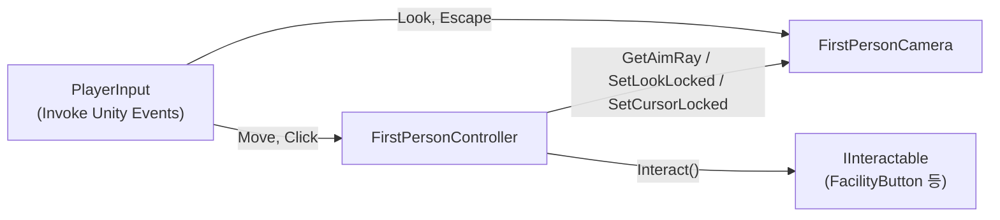

> **상태** : 계획 확정 (구현 전). 결정 사항 D1 ~ D6 확정 (8장)
> **기준** : 브랜치 `origin/feature/systemRefactoring`, 「코드 구조 분석」 문서의 분석 결과
> **목적** : 1인칭 플레이어 컨트롤러와 카메라 컨트롤러를 새로 작성한다. 1인칭 이동·시점은 유지하고, **"벽 선택 → 시점 고정 → 마우스 클릭"으로 이어지던 Interact 과정을 없애 조준선으로 버튼을 바로 누르게** 한다.
> **새 스크립트** : `Assets/Scripts/Player/FirstPersonController.cs`, `Assets/Scripts/Player/FirstPersonCamera.cs` (기존 `PlayerController`, `CameraController`는 그대로 둔다)

## 1. 배경

### 현재 방식 (레거시 PlayerController / CameraController)

```
[이동 모드] 조준선이 벽(Front/Back/Left/Right 레이어)에 닿음 → 하이라이트
     │ E 키 (Interact)
     ▼
[고정 모드] canMove=false, 카메라가 벽 앞으로 0.6초간 이동·회전
     │ 마우스 커서로 버튼 조준 (ScreenPointToRay)
     │ 왼쪽 클릭
     ▼
ButtonManager.ClickButton()  ← 레거시 버튼을 직접 호출
     │ Esc
     ▼
[이동 모드]로 복귀
```

문제점
- 버튼 하나를 누르는 데 **E → 클릭 → Esc** 세 단계가 필요하다. 시간 압박이 핵심인 게임에서 조작 비용이 크다.
- 설계 문서(「게임 진행 규칙」 1장, 「시스템 명세」 PlayerInteractor)는 **"조준선으로 일정 거리 안의 조작 오브젝트를 바로 조작"** 하는 방식이다.
- 레거시는 `ButtonManager`를 직접 호출한다. 신규 코어 계열의 `FacilityButton`(`IInteractable`)은 아무도 호출하지 않아 **수리가 불가능**하다 (「코드 구조 분석」 12장 문제 2).
- 두 스크립트가 `canMove`, `isFixed`, `playerInteracted` 이벤트로 얽혀 있고, 이동·시점·선택·하이라이트·클릭이 한 클래스에 섞여 있다.

### 새 방식

```
[항상 1인칭] WASD 이동 + 마우스 시점, 커서 잠금, 화면 중앙 조준선
     │ 왼쪽 클릭
     ▼
카메라 중앙에서 Raycast (상호작용 거리, Button 레이어)
     │ 맞은 콜라이더에서 IInteractable 탐색
     ▼
IInteractable.Interact()  → FacilityButton → FacilityA → FacilityManager …
```

- 모드 전환, 벽 선택, 시점 고정 연출, Esc 복귀를 **모두 없앤다.**
- 플레이어는 조작 장치를 보고 클릭만 하면 된다.

## 2. 범위

| 포함 | 제외 (후속 작업) |
| --- | --- |
| `FirstPersonController` : 이동, 조준 Raycast, 좌클릭 → `IInteractable.Interact()` | 슬라이더 드래그 (누름 / 드래그 / 뗌) |
| `FirstPersonCamera` : 마우스 시점, 커서 잠금 | 매뉴얼 확대 보기 (ManualViewer) |
| 입력 잠금 훅 (나중에 드래그·매뉴얼이 쓸 수 있게 자리만 만든다) | 조준 대상 하이라이트 (7장에서 선택 사항으로 다룸) |
| 테스트용 씬 구성 방법 | HUD 조준선 UI 제작, InputReader 분리, GameConfig |
| | 레거시 스크립트 수정·삭제 (12장) |

## 3. 구성 개요

### 파일

```
Assets/Scripts/Player/          ← 새 폴더 (D2)
├ FirstPersonController.cs      ← 플레이어 컨트롤러
└ FirstPersonCamera.cs          ← 카메라 컨트롤러
```

- 레거시 `Assets/Scripts/PlayerController.cs`, `CameraController.cs`는 이동·수정하지 않는다 (D1). 클래스 이름이 달라 둘이 함께 컴파일된다.

### 책임 분리

| 스크립트 | 책임 | 하지 않는 것 |
| --- | --- | --- |
| **FirstPersonController** | WASD 이동(CharacterController), 중력, 좌클릭 입력 → 조준 Raycast → `Interact()`, 커서가 풀린 상태의 클릭 처리, 입력 잠금 상태 보관 | 회전, 커서 상태 직접 관리 |
| **FirstPersonCamera** | 마우스 delta로 좌우(몸) / 상하(카메라) 회전, 커서 잠금·해제, 조준 Ray 제공 | 이동, 상호작용 판정, 클릭 입력 수신 |

### 의존 방향



- 참조는 **플레이어 → 카메라 한 방향**이다. 카메라는 플레이어를 모른다. (레거시는 카메라가 플레이어 이벤트를 구독하는 역방향 구조였다.)
- 두 스크립트 사이에 이벤트는 두지 않는다. 레거시의 `playerInteracted` 이벤트는 대응 개념이 사라지므로 만들지 않는다.
- 상호작용 대상과는 **`IInteractable` 인터페이스로만** 연결한다. `ButtonManager`, `FacilityButton` 같은 구체 타입을 모른다.
- Click 입력의 소비자는 `FirstPersonController` 하나다 (D6). 커서가 풀려 있으면 재잠금, 잠겨 있으면 상호작용.

### 오브젝트 계층

```
Player                      ← 좌우 회전(yaw)은 여기
├ CharacterController
├ PlayerInput               (Actions: InputSystem_Actions, Default Map: Player, Behavior: Invoke Unity Events)
├ FirstPersonController
└ Main Camera               ← 눈높이(localPosition y ≈ 1.6), 상하 회전(pitch)은 여기
  ├ Camera, AudioListener
  └ FirstPersonCamera
```

### 입력 바인딩 (D3, D4)

입력 에셋(`InputSystem_Actions.inputactions`)은 수정하지 않는다. 이미 있는 액션을 PlayerInput의 Unity Events로 연결한다.

| 액션 (Player 맵) | 키 | 연결 대상 |
| --- | --- | --- |
| Move | WASD / 방향키 | `FirstPersonController.OnMove` |
| Click | **마우스 왼쪽** | `FirstPersonController.OnClick` |
| Look | 마우스 delta | `FirstPersonCamera.OnLook` |
| Escape | Esc | `FirstPersonCamera.OnEscape` (커서 해제) |
| Interact (E) | — | **연결하지 않는다.** 새 방식에서는 쓰지 않음 |

## 4. FirstPersonController 명세

### 인스펙터 필드 (안)

| 필드 | 타입 | 기본값 | 설명 |
| --- | --- | --- | --- |
| `characterController` | CharacterController | (같은 오브젝트) | 비어 있으면 `GetComponent` |
| `firstPersonCamera` | FirstPersonCamera | — | 조준 Ray, 시점 잠금, 커서 잠금에 사용 |
| `moveSpeed` | float | 3 | m/초. 「게임 진행 규칙」 10장 |
| `gravity` | float | -9.81 | 바닥에 붙어 있게 하는 용도. 점프 없음 (D5) |
| `interactDistance` | float | 2 | m. 「게임 진행 규칙」 10장 |
| `interactLayerMask` | LayerMask | Button (+ 추후 Slider) | 상호작용 Raycast 대상 |

### 내부 상태

| 상태 | 설명 |
| --- | --- |
| `_moveInput : Vector2` | Move 액션 값 |
| `_verticalVelocity : float` | 중력 누적. 접지 시 작은 음수로 고정 |
| `_lockCount : int` | 입력 잠금 요청 수. 0보다 크면 이동·상호작용 무시 (6장) |

### 공개 API (안)

| 멤버 | 설명 |
| --- | --- |
| `OnMove(InputAction.CallbackContext)` | PlayerInput 이벤트 수신. `_moveInput` 갱신 |
| `OnClick(InputAction.CallbackContext)` | PlayerInput 이벤트 수신. `performed`일 때만 처리 (아래 상호작용 참고) |
| `bool IsInputLocked` | `_lockCount > 0` |
| `void SetInputLocked(bool locked)` | 이동 잠금 + 카메라 시점 잠금을 함께 요청 (6장) |

### 동작

**이동 (Update)**
1. 잠금 상태면 수평 이동 0.
2. `direction = transform.forward * _moveInput.y + transform.right * _moveInput.x`
   - 레거시는 변수명 `xMove`/`zMove`가 축과 반대로 붙어 있어 헷갈렸다. 새 코드는 입력 축 이름 그대로 쓴다.
   - WASD 컴포지트는 기본 모드(Digital Normalized)에서 이미 정규화되므로 대각선 속도 보정은 필요 없다. 게임패드 대비로 `Vector2.ClampMagnitude(_, 1)`만 건다.
3. 접지 중이면 `_verticalVelocity = -2` 정도로 고정, 아니면 `gravity * dt` 누적.
4. `characterController.Move((direction * moveSpeed + Vector3.up * _verticalVelocity) * Time.deltaTime)` 한 번 호출.

**좌클릭 (OnClick)**

```
OnClick(performed)
├─ 커서가 풀려 있음  → firstPersonCamera.SetCursorLocked(true) 후 끝 (상호작용 없음)
├─ 입력 잠금 중      → 무시
└─ 그 외            → TryInteract()
```

**TryInteract**
1. `Ray ray = firstPersonCamera.GetAimRay()` — 카메라 위치에서 카메라 forward.
2. `Physics.Raycast(ray, out hit, interactDistance, interactLayerMask, QueryTriggerInteraction.Ignore)`
3. 맞으면 `hit.collider.GetComponentInParent<IInteractable>()`
   - Button 프리팹은 루트·`Clickable`·`FoucsIndicator`에 모두 콜라이더가 있다. 자식 콜라이더가 맞아도 루트의 `FacilityButton`을 찾도록 `GetComponentInParent`를 쓴다.
4. 찾으면 `Interact()` 호출. 못 찾으면 아무것도 하지 않는다 (레거시의 null 참조 버그 재발 방지).

레거시와 달라지는 점
- Ray 시작점이 **카메라 위치**다. 레거시는 플레이어 몸 위치에서 카메라 방향으로 쏴서 조준선과 실제 판정 위치가 어긋났다.
- Raycast는 **클릭 순간에만** 한다. 매 프레임 쏘는 것은 하이라이트를 넣을 때만 필요하다 (7장).
- E 키 선택, 머티리얼 교체, 선택 상태(`selectedItem`), 벽 레이어 판정이 전부 빠진다.

## 5. FirstPersonCamera 명세

### 인스펙터 필드 (안)

| 필드 | 타입 | 기본값 | 설명 |
| --- | --- | --- | --- |
| `playerBody` | Transform | (부모) | 좌우 회전 대상. 비어 있으면 `transform.parent` |
| `sensitivity` | float | 0.1 | 마우스 delta(픽셀) 배율. 레거시 `cameraSpeed` 0.4를 참고해 플레이하며 조정 |
| `minPitch` / `maxPitch` | float | -85 / 85 | 상하 각도 제한. 레거시는 ±90이라 정확히 위/아래를 볼 때 뒤집힘 위험 |
| `lockCursorOnEnable` | bool | true | 활성화 시 커서 잠금 |

### 내부 상태

| 상태 | 설명 |
| --- | --- |
| `_lookInput : Vector2` | 이번 프레임까지 누적된 마우스 delta |
| `_pitch : float` | 현재 상하 각도 |
| `_isLookLocked : bool` | 시점 잠금 |

### 공개 API (안)

| 멤버 | 설명 |
| --- | --- |
| `OnLook(InputAction.CallbackContext)` | delta를 `_lookInput`에 **누적**한다 (한 프레임에 이벤트가 여러 번 올 수 있으므로 대입이 아니라 더하기) |
| `OnEscape(InputAction.CallbackContext)` | `performed`일 때 커서 해제 |
| `Ray GetAimRay()` | `new Ray(transform.position, transform.forward)` |
| `void SetLookLocked(bool locked)` | 시점 잠금. 잠글 때 누적 delta를 버린다 |
| `void SetCursorLocked(bool locked)` | `Cursor.lockState`, `Cursor.visible` 설정 |
| `bool IsCursorLocked` | 현재 커서 잠금 여부 |

### 동작

**시점 회전 (Update)**
1. 시점 잠금이거나 커서가 잠겨 있지 않으면 `_lookInput`만 비우고 끝.
2. `delta = _lookInput * sensitivity`, `_lookInput = 0`
3. `_pitch = Clamp(_pitch - delta.y, minPitch, maxPitch)` → `transform.localRotation = Euler(_pitch, 0, 0)`
4. `playerBody.Rotate(Vector3.up, delta.x)`
- 마우스 delta는 이미 프레임 이동량이므로 `Time.deltaTime`을 곱하지 않는다 (레거시와 같음).

**커서**
- `OnEnable`에서 잠그고, `OnDisable`에서 해제한다.
- Esc(`Player/Escape`)로 커서를 해제한다 (에디터에서 창 밖으로 마우스를 빼기 위한 용도).
- 커서가 풀린 상태에서 좌클릭하면 **상호작용 없이 커서만 다시 잠긴다.** 이 처리는 `FirstPersonController.OnClick`이 맡고, 카메라는 `SetCursorLocked(true)` 요청만 받는다 (D6).
- 창이 포커스를 잃었다 돌아올 때(`OnApplicationFocus`)는 잠금 상태를 다시 적용한다.

**레거시에서 빠지는 것** : `isFixed`, `FixedItem()` 이동 연출, 벽 방향 판정(`inwardNormal`), `playerInteracted` 구독, `viewDistance`, SmoothStep 보간.

## 6. 입력 잠금 훅

지금 당장 쓰는 곳은 없지만, 설계상 두 곳에서 필요하므로 자리만 만든다.
- 슬라이더를 잡고 드래그하는 동안 이동·시점 정지 (「게임 진행 규칙」 7장 설비 B)
- 매뉴얼 확대 보기 동안 이동·시점 정지 (「게임 진행 규칙」 1장)

방식
- `FirstPersonController.SetInputLocked(bool)`이 유일한 창구다. 내부에서 이동을 막고 `firstPersonCamera.SetLookLocked(...)`를 부른다.
- 잠금 요청자가 여럿일 수 있으므로 bool 대신 **카운트**(`_lockCount++/--`)로 관리한다. 한 요청자가 풀었는데 다른 요청자는 아직 잠그고 있는 상황을 막는다.
- 이번 작업에서는 이 API만 만들고 호출자는 없다.

## 7. 조준 대상 하이라이트 (선택 사항)

버튼을 바로 누르는 방식에서는 "지금 무엇을 조준하고 있나"가 보이면 좋다.

| 방안 | 내용 | 비고 |
| --- | --- | --- |
| A. 기존 `ButtonOutline` 유지 | `OnMouseEnter/Exit` 기반 | 커서가 잠기면 마우스 위치가 화면 중앙으로 고정되므로 동작할 **가능성**은 있으나 확인 필요. 동작하면 추가 작업 없음 |
| B. 컨트롤러가 매 프레임 조준 | `FirstPersonController`가 `LateUpdate`에서(카메라 회전 뒤) Raycast, 대상이 바뀌면 `IFocusable.OnFocusEnter/Exit` 같은 인터페이스 호출 | 설계 문서의 "조준 시작 / 끝" 확장과 일치. 인터페이스 추가 필요 |
| C. 조준선 색만 바꿈 | 조준 대상이 있으면 HUD 조준점 색 변경 | 가장 단순. HUD 필요 |

권장 : 이번 작업에서는 **A를 확인만** 하고, 동작하지 않으면 B를 후속 작업으로 둔다.

## 8. 결정 사항 (확정)

| # | 항목 | 결정 |
| --- | --- | --- |
| D1 | 클래스 이름 | **새 이름 사용** : `FirstPersonController`, `FirstPersonCamera`. 기존 `PlayerController`, `CameraController`는 그대로 둔다 |
| D2 | 파일 위치 | **새 폴더** `Assets/Scripts/Player/` |
| D3 | 상호작용 키 | **좌클릭** (`Player/Click` 액션). 입력 에셋 수정 없음. E(`Player/Interact`)는 쓰지 않는다 |
| D4 | 입력 수신 방식 | **PlayerInput + Unity Events** (레거시와 같은 방식). InputReader 분리는 후속 |
| D5 | 중력 | **넣는다.** 점프는 없음 |
| D6 | 커서 재잠금 클릭 처리 | **`FirstPersonController.OnClick`에서 처리.** Click 입력의 소비자는 하나 |

## 9. 선행 · 병행 작업 (이 두 스크립트 밖)

새 컨트롤러가 `Interact()`를 부르기 시작하면 아래가 바로 드러난다. 컨트롤러 작업과 별개지만 테스트하려면 필요하다.

| 항목 | 내용 | 참고 |
| --- | --- | --- |
| **FacilityButton의 Animator / MeshRenderer** | `RefactoringTesetScene`의 버튼 루트에는 둘 다 없어 `Interact()`에서 NRE가 난다. 인스펙터 참조로 바꾸거나 없으면 건너뛰도록 수정 필요 | 「코드 구조 분석」 12장 문제 3 |
| 수리 완료 이벤트 | 버튼을 맞춰도 타이머·패널이 복귀하지 않는다. 컨트롤러 동작 확인과는 무관하지만 한 판 테스트에는 필요 | 같은 문서 문제 4, 5 |
| FaultScheduler 범위 검사 | 2번째 고장 수리 후 예외 | 같은 문서 문제 1 |
| 테스트 씬 | `RefactoringTesetScene`에 플레이어가 없다. 3장 계층대로 Player를 추가하고 `Main Panel Display`, 설비 A 앞에 배치 | |
| 조준선 | 화면 중앙 점이 없으면 조준이 어렵다. 임시로 Canvas + 작은 Image 하나 | PlayerAndSpace의 `Pointer` 오브젝트 재사용 가능 |

## 10. 작업 순서

1. `Assets/Scripts/Player/` 폴더 생성
2. `FirstPersonCamera` 작성 : 시점 회전, 커서 잠금·해제(Esc), `GetAimRay()`, `SetLookLocked()`
3. `FirstPersonController` 작성 : 이동, 중력, `OnClick`(커서 재잠금 / `TryInteract()`), 잠금 API
4. 테스트 씬에 Player 계층 구성, PlayerInput 이벤트 연결 (3장 입력 바인딩 표)
5. FacilityButton NRE 수정 (9장) 후 버튼 클릭 확인
6. `ButtonOutline` 하이라이트 동작 확인 (7장 방안 A)
7. 11장 완료 기준 확인

## 11. 완료 기준

| # | 확인 항목 |
| --- | --- |
| 1 | WASD로 이동한다. 벽을 통과하지 않는다. 대각선 이동이 더 빠르지 않다 |
| 2 | 마우스로 시점이 돈다. 상하가 ±85°에서 멈춘다. 좌우 회전 시 이동 방향이 시점을 따라간다 |
| 3 | 게임 시작 시 커서가 잠기고 보이지 않는다. Esc로 풀리고, 좌클릭하면 다시 잠기며 이때는 버튼이 눌리지 않는다 |
| 4 | 조준선이 버튼 위에 있을 때 좌클릭 한 번으로 `FacilityButton.Interact()`가 호출되고 색이 바뀐다. **E·Esc 같은 추가 입력이 필요 없다** |
| 5 | 버튼의 자식 콜라이더(`Clickable`, `FoucsIndicator`)를 조준해도 눌린다 |
| 6 | `interactDistance`(2m)보다 먼 버튼, Button 레이어가 아닌 물체, 빈 공간을 클릭하면 아무 일도 일어나지 않고 오류도 없다 |
| 7 | `SetInputLocked(true)`를 호출하면 이동·시점·상호작용이 모두 멈추고, `false`로 되돌리면 복귀한다 (임시 테스트 코드나 인스펙터로 확인) |
| 8 | 레거시 씬(PlayerAndSpace)은 기존대로 동작한다 (새 스크립트가 레거시에 영향 없음) |

## 12. 레거시 처리

- 기존 `PlayerController`, `CameraController`, `SelectColliderController`는 **수정하지 않고 그대로 둔다** (D1). PlayerAndSpace 씬도 기존 스크립트로 계속 동작한다.
- 레거시 제거는 이번 계획 범위 밖이다. 나중에 제거할 때 함께 정리할 것 : `ButtonManager`(단, `ButtonStatus` 열거형을 먼저 별도 파일로 이동), `ButtonPanelManager`, `ChangeButtonColor`, Front/Back/Left/Right 레이어의 용도, PlayerAndSpace 씬의 PlayerInput 이벤트 연결.

## 13. 완성 후 조작 방식

| 입력 | 결과 |
| --- | --- |
| 게임 시작 | 커서가 사라지고 화면 중앙에 조준점. 바로 이동·시점 조작 가능 |
| WASD | 바라보는 방향 기준으로 걷기 (3 m/초). 달리기·점프 없음 |
| 마우스 이동 | 좌우는 몸 회전, 상하는 고개 회전 (±85°) |
| 좌클릭 | 조준점이 2m 안의 버튼을 가리키면 그 버튼이 바로 눌린다. 그 외에는 아무 일도 없다 |
| Esc | 커서가 풀린다. 다음 좌클릭은 커서만 다시 잠그고 버튼은 누르지 않는다 |

플레이 흐름 예시 (설비 A 고장)
1. 전면 메인 패널을 보다가 "설비 A 기능 고장"과 타이머를 확인한다.
2. 마우스로 몸을 좌측면으로 돌리고, WASD로 버튼 패널 앞(2m 이내)까지 걸어간다.
3. 버튼 위 가이드 구체의 색을 보면서, 조준점을 버튼에 맞추고 좌클릭한다. 한 번 누를 때마다 회색 → 빨강 → 초록 → 회색으로 바뀐다.
4. 16개를 가이드대로 맞추면 설비가 정상으로 돌아온다. 걷거나 고개를 돌리는 도중에도 언제든 클릭할 수 있고, 모드 전환이나 복귀 입력은 없다.
